# 现代操作系统应用开发 实验2

## 个人信息

【院系】计算机学院

【专业】软件工程

【学号】20337037

【姓名】洪梓

## 实验题目

个人作业-UI组件布局及动画学习:

实现一个包含若干页面和子页面的“打卡”App

## 实验目的

1. 学习使用纯代码进行UI布局
2. 学习TableView，UICollectionView，UINavigationController，UICollectionController，UITabBarController等组件的使用，以及delegate和protocol的概念。
3. 学习使用UIView动画及Core Animation动画

## 实验方案

### **开发环境**：

Mac OS/Objective-C/Xcode

### **实验要求：**

1.下方导航栏分为三个页面：发现、打卡、我的，点击按钮切换到对应的页面。按钮在选中和未选中状态下图片和文字的颜色都不同。每个页面上方显示页面标题。

2.我的

- 未登录时的我的页面只有一个圆形的登录按钮，登录按钮水平居中、垂直居中。登录页面的背景是渐变的，背景色从中心向四周渐变。
- 点击登录按钮后进入用户信息界面。

3.用户信息

我的页面包含用户头像、用户基本信息以及APP的通用信息功能。用户头像为圆形，居中显示。

4.打卡

- 页面包含若干个单行输入框：时间/地点/名称、一个多行输入框：评论，图片选取及发布按钮。
- 点击配图处的加号，可以从相册中选择图片上传并展示，按照每行三张图的方式显示，要求图片之间的边距相等。
- 点击发布按钮，先展示动画效果再跳转到发现页面。动画效果可以设计为在屏幕中央显示一个发布成功的弹窗，持续时间0.5s，然后跳转到发现页面显示最新添加的打卡记录。

5.发现

- 页面的背景是渐变的，背景色从左上角到右下角渐变（颜色可自选）。
- 搜索框可以输入任意信息对打卡信息进行快速检索。
- 打卡清单是一个可以滚动的列表，默认显示全部打卡记录。打卡记录按时间倒序从上至下排列。
- 每个打卡记录为一个圆角矩形，点击某一个打卡记录会显示0.5s的转场动画，之后跳转到打卡详情页

### **实验方案：**

**代码结构**

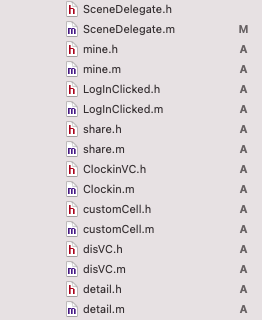

- SceneDelegate作为根控制器，实现导航栏来控制发现/打卡/我的 三个子控制器
- mine为“我的”登录界面
- LoginClicked为“我的”登录后个人信息界面
- share用来储存打卡条目，可被全局调用
- clockin为打卡界面
- customcell为发现页面的打卡条目
- disVC为发现页面
- detail为打卡详情页面

**1.SceneDelegate**

SceneDelegate负责设置首个页面，所以在该文件创建一个窗口并加入UITabBarController实现的根控制器，再创建三个ViewController加入底部导航栏中，设置每个子控制器的标题和图标，点击相应图标即可跳转到该页面。

每个tabBarItem处于选中或未选中状态颜色应该是不同的，通过设置tabBarItem.selectedImage和tabBarItem.image来使得图标未选中时灰暗，选中时变为蓝色。

```objectivec
- (void)scene:(UIScene *)scene willConnectToSession:(UISceneSession *)session options
             :(UISceneConnectionOptions *)connectionOptions {
    
    // Use this method to optionally configure and attach the UIWindow `window` to the provided UIWindowScene `scene`.
    // If using a storyboard, the `window` property will automatically be initialized and attached to the scene.
    // This delegate does not imply the connecting scene or session are new (see `application:configurationForConnectingSceneSession` instead).
    UIWindowScene *windowScene = (UIWindowScene *)scene;
    self.window = [[UIWindow alloc] initWithWindowScene:windowScene];
    self.window.frame = windowScene.coordinateSpace.bounds;
    self.window.backgroundColor = [UIColor whiteColor];
    
    UITabBarController *bar = [[UITabBarController alloc] init];
    self.window.rootViewController = bar;
    
    disVC *vc1 = [[disVC alloc]init];
    UINavigationController *c1 = [[UINavigationController alloc] initWithRootViewController:vc1];
    c1.title = @"discover";
    c1.tabBarItem.selectedImage = [UIImage imageNamed:@"disicon.png"];
    c1.tabBarItem.image = [UIImage imageNamed:@"disicon.png"];
    c1.tabBarItem.title = @"discover";
    
    ClockinVC *vc2 = [[ClockinVC alloc] init];
    UINavigationController *c2 = [[UINavigationController alloc] initWithRootViewController:vc2];
    c2.title = @"clockIn";
    c2.tabBarItem.selectedImage = [UIImage imageNamed:@"penicon.png"];
    c2.tabBarItem.image = [UIImage imageNamed:@"penicon.png"];
    c2.tabBarItem.title = @"clockIn";
    
    mineVC *vc3 = [[mineVC alloc] init];
    UINavigationController *c3 = [[UINavigationController alloc] initWithRootViewController:vc3];
    c3.title = @"Mine";
    c3.tabBarItem.selectedImage = [UIImage imageNamed:@"mineicon.png"];
    c3.tabBarItem.image = [UIImage imageNamed:@"mineicon.png"];
    c3.tabBarItem.title = @"Mine";
    
    bar.viewControllers = @[c1, c2, c3];
    [self.window makeKeyAndVisible];
```

**2.mine**

- 未登录时界面中央圆形登录按钮

cornerRadius即边框圆角的半径，将半径设为1/2边长时图片为圆形。在viewDidLoad中设置按钮的背景颜色/边框粗细/边框颜色/字体颜色等属性。

```objectivec
- (void)viewDidLoad {
    [super viewDidLoad];
    // Do any additional setup after loading the view.
    self.title = @"Mine";
    //设置渐变背景
    [self setBackground];
    //登录按钮
    UIButton *SignIN = [[UIButton alloc] initWithFrame:CGRectMake(0,0, 150, 150)];
    //按钮居中
    SignIN.center = CGPointMake(self.view.center.x, self.view.center.y);
    SignIN.backgroundColor = [UIColor whiteColor];
    [SignIN showsTouchWhenHighlighted];
    SignIN.layer.cornerRadius =  SignIN.layer.frame.size.width/2;
    SignIN.layer.borderColor = [UIColor colorWithRed:28/255.0 green:56/255.0 blue:121/255.0 alpha:1].CGColor;
    [SignIN.layer setBorderWidth:2];
    [SignIN setTitle:@"LogIn" forState:UIControlStateNormal];
    [SignIN setTitleColor:[UIColor colorWithRed:28/255.0 green:56/255.0 blue:121/255.0 alpha:1] forState:UIControlStateNormal];
    [SignIN addTarget:self action:@selector(logInBtn:) forControlEvents:UIControlEventTouchUpInside];
    [self.view addSubview:SignIN];
}
```

点击登录按钮跳转到“我的”登录后个人信息界面

在iOS开发中，UInavigationController是很常用的controller，对它的一般操作就像操作一个栈，push和pop。因此实现页面的跳转只需要将目标页面的viewcontroller添加进栈中并将前一个页面删除。

进入个人信息界面后也可通过同样原理点击页面左上方“back”按钮来模拟退出登录。

```objectivec
- (void) logInBtn:(UIButton *)btn {
    LogInClicked *nextvc = [[LogInClicked alloc] init];
    NSMutableArray *vcs = [NSMutableArray arrayWithArray:self.navigationController.viewControllers];
    [vcs removeObjectAtIndex:0];
    [vcs addObject:nextvc];
    [self.navigationController setViewControllers:vcs animated:YES];
```

- 实现背景颜色渐变

通过CGGradientCreateWithColors生成渐变背景图片，将图片设为背景

```objectivec
//生成渐变背景图
- (UIImage *)gradient:(NSArray*) colors {
    CGSize imgSize = self.view.frame.size;
    NSMutableArray *array = [NSMutableArray array];
    for (UIColor *color in colors)
        [array addObject:(id)color.CGColor];
    UIGraphicsBeginImageContextWithOptions(imgSize, YES, 1);
    CGContextRef context = UIGraphicsGetCurrentContext();
    CGContextSaveGState(context);
    CGColorSpaceRef colorSpace = CGColorGetColorSpace([[colors lastObject] CGColor]);
    CGGradientRef gra = CGGradientCreateWithColors(colorSpace, (CFArrayRef) array, NULL);
    CGPoint center = CGPointMake(imgSize.width/2, imgSize.height/2);
    CGFloat radius = MAX(imgSize.width/2, imgSize.height/2) * sqrt(2);
    CGContextDrawRadialGradient(context, gra, center, 0, center, radius, 0);
    UIImage *img = UIGraphicsGetImageFromCurrentImageContext();
    CGGradientRelease(gra);
    CGContextRestoreGState(context);
    CGColorSpaceRelease(colorSpace);
    UIGraphicsEndImageContext();
    return img;
}
```

**3.LogInClicked**

该页面是登录后跳转的页面，显示用户的头像/用户名/邮箱/电话，app的版本号/隐私/cookie等，主要是绘制不同的label，调整好布局，最后将所有label添加到view中即可。使用静态布局时可以将每个label的坐标设为手机屏幕长宽的倍数而非数字坐标，以适应不同尺寸的手机屏幕，例如以下代码：

```objectivec
UIImage *head = [UIImage imageNamed:@"head.JPG"];
    UIImageView *header = [[UIImageView alloc] initWithImage:head];
    header.frame = CGRectMake(self.view.frame.size.width/3, self.view.frame.size.height/7, self.view.frame.size.width/3, self.view.frame.size.width/3);
    header.layer.masksToBounds = YES;
    header.layer.cornerRadius = header.layer.frame.size.width/2;
    header.contentMode = UIViewContentModeScaleAspectFit;
    header.backgroundColor = [UIColor whiteColor];
```

**4.share**

成员变量是一个可变数组datalist，用来存储在打卡页面上传的打卡条目

```objectivec
-(id)init {
    if(self = [super init]) {
        self->_datalist = [[NSMutableArray alloc] init];
    }
    return self;
}
+(instancetype)sharedInstance {
    static share *myInstance = nil;
    if(myInstance == nil) {
        myInstance = [[share alloc]init];
    }
    return myInstance;
}
```

**5.clockin**

用户在打卡页面输入时间/地点/名称/评论并上传图片进行打卡，使用UITextField实现多行输入框，绘制一个上传按钮，点击按钮调用addpics（添加图片）函数，在页面右上角添加rightBarButtonItem作为发布按钮。

该类成员变量：

```objectivec
@interface ClockinVC ()<UIImagePickerControllerDelegate,UINavigationControllerDelegate>
@property NSInteger cnt;//上传图片数量
@property (nonatomic, strong) UIImageView* imagView;//显示图片
@property (copy, nonatomic) NSMutableArray *imagList;//图片数组
@property (nonatomic, strong) UIImagePickerController *imagPicker;////图像选择器
@property (nonatomic, strong) UITextView *t1;//输入框
@property (nonatomic, strong) UITextView *t2;
@property (nonatomic, strong) UITextView *t3;
@property (nonatomic, strong) UITextView *t4;
@property (nonatomic, strong) UIButton *add;//添加图片按钮
@end
```

以上为打卡的初始化页面，与设置背景颜色一并写在viewWillAppear中，确保每次进入打卡页面都可以刷新掉上一次填入内容。具体代码不进行展示。

- 发布图片

 iOS图像选取器UIImagePickerController可以帮助我们调用和相投拍照或者从相册中选择图片，didFinishPickingMediaWithInfo函数将获取到的图片显示在打卡页面上。

```objectivec
-(void)Addpics {
    self.imagPicker = [[UIImagePickerController alloc]init];
    self.imagPicker.delegate = (id)self;
    self.imagPicker.allowsEditing = YES;
    
    UIAlertController *actions = [UIAlertController alertControllerWithTitle:nil message:nil preferredStyle:UIAlertControllerStyleActionSheet];//弹框
    
    UIAlertAction *shoot = [UIAlertAction actionWithTitle:@"Shoot" style:UIAlertActionStyleDefault handler:^(UIAlertAction * _Nonnull action) {
        if([UIImagePickerController isSourceTypeAvailable:UIImagePickerControllerSourceTypeCamera]) {
            self.imagPicker.sourceType
            = UIImagePickerControllerSourceTypeCamera;
            [self presentViewController:self.imagPicker animated:YES completion:nil];
        }
    }];
    
    UIAlertAction *selectPic = [UIAlertAction actionWithTitle:@"Choose" style:UIAlertActionStyleDefault handler:^(UIAlertAction * _Nonnull action) {
        self.imagPicker.sourceType = UIImagePickerControllerSourceTypePhotoLibrary;
        [self presentViewController:self.imagPicker animated:YES completion:nil];
    }];
    
    UIAlertAction *cancel = [UIAlertAction actionWithTitle:@"Cancel" style:UIAlertActionStyleDefault handler:^(UIAlertAction * _Nonnull action) {
        NSLog(@"Cancel");
    }];
    
    [actions addAction:shoot];
    [actions addAction:selectPic];
    [actions addAction:cancel];
    [self presentViewController:actions animated:YES completion:nil];
}
-(void)imagePickerController:(UIImagePickerController *)picker didFinishPickingMediaWithInfo:(NSDictionary<NSString *,id> *)info {
    [picker dismissViewControllerAnimated:YES completion:nil];
    //获得添加的图片
    UIImage *img = [info objectForKey:UIImagePickerControllerOriginalImage];
    
    UIImageView *temp = [[UIImageView alloc] init];
    //一排三张图片
    temp.frame = CGRectMake(3*self.view.frame.size.width/10+75*(self.cnt%3), 7*self.view.frame.size.width/9+20+75*(self.cnt/3), 70, 70);
    temp.image = img;
    [_imagList addObject:img];
    [self.view addSubview:temp];
    _cnt++;
    NSLog(@"succeed");
    
    //添加图片按钮往后移动
    self.add.frame = CGRectMake(3*self.view.frame.size.width/10+80*(self.cnt%3), 7*self.view.frame.size.width/9+20, 50, 50);
    if (_cnt >= 3)
        self.add.enabled = false;
}
//取消添加图片
- (void) imagPickerControllerDidCancel:(UIImagePickerController *)picker {
    [picker dismissViewControllerAnimated:YES completion:nil];
}
```

- 发布

使用NSDictionary来实现标签名和输入文本的映射和存储，并将该结构传进share的datalist中。绘制弹框提示发布成功。点击发布按钮相当于实现一次打卡，打卡成功后将本次打卡存储图片的imglist清空并跳转到发现页面。调用loadview函数刷新发布页面。

```objectivec
-(void)Fabu: (UIButton*) btn {
    NSDictionary *temp = [[NSDictionary alloc] init];
    temp = @{@"date":_t1.text,
             @"place":_t2.text,
             @"name":_t3.text,
             @"comment":_t4.text,
             @"image":_imagList.mutableCopy
        
    };
    [[share sharedInstance].datalist addObject:temp];
    NSLog(@"我发");
    UIAlertController *alert = [UIAlertController alertControllerWithTitle:@"title" message:@"Successfully Updated" preferredStyle:UIAlertControllerStyleAlert];
    [alert addAction:[UIAlertAction actionWithTitle:@"OK" style:UIAlertActionStyleDefault handler:nil]];
    [self presentViewController:alert animated:true completion:nil];
    self.tabBarController.selectedIndex = 0;//跳转到导航栏的第0页
    _cnt = 0;
    [_imagList removeAllObjects];
    [NSThread sleepForTimeInterval:0.5];
    [self loadView];
}
```

**6.divVC**

使用UITableView实现打卡页面，UITableView按行分组显示内容，垂直方向滚动的scrollview，适用于内容不断加载的场景。每行打卡数据都是一个UITableViewCell。

- 创建TableView

```objectivec
- (void)makeTable {
    //按照时间排序
    NSSortDescriptor *sortDescriptor = [[NSSortDescriptor alloc]initWithKey:@"date" ascending:NO];
    [[share sharedInstance].datalist sortUsingDescriptors:[NSArray arrayWithObject:sortDescriptor]];
    //设置背景渐变
    [self makeBackground];
    _tableView = [[UITableView alloc] initWithFrame:CGRectMake(0, 0, self.view.frame.size.width, self.view.frame.size.height) style:UITableViewStyleGrouped];
    _tableView.delegate = self;
    _tableView.dataSource = self;
    _tableView.backgroundColor = [UIColor clearColor];
    [self.view addSubview:_tableView];
}
```

- 实现搜索

UISearchController 让用户在searchBar上搜索关键词并展示搜索结果，创建一个UISearchController实例，参数SearchResultsController:nil表示没有单独显示搜索结果的界面，即使用当前界面来显示。obscuresBackgroundDuringPresentation表示搜索栏进入搜索状态时上面会不会显示一层半透明的遮罩。设置searchResultsUpdater以监听搜索事件，最后将UISearchController放在tableview的顶部。

```objectivec
- (void)doSearch {
    self.search = [[UISearchController alloc]initWithSearchResultsController:nil];
    self.search.searchResultsUpdater = self;
    self.search.obscuresBackgroundDuringPresentation = NO;
    [self.search.searchBar sizeToFit];
    self.tableView.tableHeaderView = self.search.searchBar;
}
```

- 定义数据源UITableViewDataSource

```objectivec
//一个section实现一个打卡记录，即返回一共有多少个打卡记录
- (NSInteger)numberOfSectionsInTableView:(UITableView *)tableView {
    if(self.search.active)
        return self.result.count;
    return [share sharedInstance].datalist.count;

}
- (NSInteger)didSelectRowAtIndexPath:(UITableView *)tableView numberOfRowsInSection:(NSInteger)section {
    return 1;
}
//创建cell，设置cell的细节
- (UITableViewCell *)tableView:(UITableView *)tableView cellForRowAtIndexPath:(NSIndexPath *)indexPath {
    static NSString *identifier = @"cell";
    customCell *cell = [tableView dequeueReusableCellWithIdentifier:identifier];
    if(cell == nil) {
        cell = [[customCell alloc] initWithStyle:UITableViewCellStyleDefault reuseIdentifier:identifier];
        cell.accessoryType = UITableViewCellAccessoryDisclosureIndicator;
    }
    //cell外观
    cell.textLabel.numberOfLines = 3;
    cell.layer.borderWidth = 1;
    cell.layer.borderColor = [UIColor lightGrayColor].CGColor;
    cell.layer.cornerRadius = 10;
    cell.backgroundColor = UIColor.whiteColor;
    if(self.search.active) {
			  //如果处于搜索状态，只把搜索结果数组中打卡生成cell
        [cell setlabel1Text:self.result[indexPath.section][@"date"]
              setlabel2Text:self.result[indexPath.section][@"place"]
              setlabel3Text:self.result[indexPath.section][@"name"]];
    }
    else {
	      //所有打卡
        [cell setlabel1Text:[share sharedInstance].datalist[indexPath.section][@"date"]
              setlabel2Text:[share sharedInstance].datalist[indexPath.section][@"place"]
              setlabel3Text:[share sharedInstance].datalist[indexPath.section][@"name"]];
    }
    return cell;
}
```

- 实现委托

使用updateSearchResultsForSearchController方法显示搜索结果

```objectivec
- (void)updateSearchResultsForSearchController:(UISearchController *)searchController {
    NSString *inputstr = searchController.searchBar.text;
    //如果结果数组残留上一次搜索数据，将其清除
    if(self.result.count >0) {
        [self.result removeAllObjects];
    }
	  //如果打卡时输入的全部文本中含有搜索关键词，将其添加到结果数组
    for(NSDictionary *dic in [share sharedInstance].datalist) {
        NSString *temp1 = dic[@"date"];
        NSString *temp2 = dic[@"place"];
        NSString *temp3 = dic[@"name"];
        temp1 = [temp1 stringByAppendingString:temp2];
        temp1 = [temp1 stringByAppendingString:temp3];
        if ([temp1.lowercaseString rangeOfString:inputstr.lowercaseString].location != NSNotFound) {
            [self.result addObject:dic];
        }
    }
		//完成搜索，重新刷新发现界面
    [self.tableView reloadData];
}
```

使用didSelectRowAtIndexPath实现交互动作

```objectivec
- (void)tableView:(UITableView *)tableView didSelectRowAtIndexPath:(NSIndexPath *)indexPath {
    //绘制详情页面
		CGRect screenFrame = [UIScreen mainScreen].bounds;
    int screenWidth = screenFrame.size.width;
    int screenheight = screenFrame.size.height;
    details *newpage = [[details alloc]init];
    newpage.label1 = [[UILabel alloc]initWithFrame:CGRectMake(30, screenheight/10, 100, 60)];
    newpage.label1.text = [share sharedInstance].datalist[indexPath.section][@"date"];
    newpage.label2 = [[UILabel alloc]initWithFrame:CGRectMake(30, screenheight/10+30, 100, 60)];
    newpage.label2.text = [share sharedInstance].datalist[indexPath.section][@"place"];
    newpage.label3 = [[UILabel alloc]initWithFrame:CGRectMake(30, screenheight/10+60, 100, 60)];
    newpage.label3.text = [share sharedInstance].datalist[indexPath.section][@"name"];
    newpage.textview = [[UITextView alloc]initWithFrame:CGRectMake(27, screenheight/10+110, screenWidth/6 *5, screenheight/3)];
    [newpage.textview setText:[share sharedInstance].datalist[indexPath.section][@"comment"]];
    newpage.viewww =[[UIView alloc] init];
    NSMutableArray *ma = [share sharedInstance].datalist[indexPath.section][@"image"];
    for(UIImage *img in ma) {
        UIImageView *t = [[UIImageView alloc] initWithFrame:CGRectMake(40+105*(_count%3)-10, screenheight/2, 100, 100)];
        _count++;
        t.image = img;
        [newpage.viewww addSubview:t];
    }
    _count = 0;
    [self Donghua:@"cube" controller:newpage];
    
}
```

- 实现UITableView中cel的删除

编辑状态返回delete态，实现响应删除动作。点击删除时设置包括“确认”和“”取消“的弹框提醒删除动作，确认则将数据源里该条目删除，并重新加载tableview的数据，取消则不进行操作。

```objectivec
- (UITableViewCellEditingStyle)tableView:(UITableView *)tableView editingStyleForRowAtIndexPath:(NSIndexPath *)indexPath {
    return UITableViewCellEditingStyleDelete;
}
- (void)tableView:(UITableView *)tableView commitEditingStyle:(UITableViewCellEditingStyle)editingStyle forRowAtIndexPath:(NSIndexPath *)indexPath {
    if(editingStyle == UITableViewCellEditingStyleDelete) {
        NSInteger row = [indexPath section];
        NSLog(@"%ld",row);
        UIAlertController *alert = [UIAlertController alertControllerWithTitle:nil message:@"Are you sure?" preferredStyle:UIAlertControllerStyleAlert];
        _ok = [UIAlertAction actionWithTitle:@"Yes" style:UIAlertActionStyleDefault handler:^(UIAlertAction * _Nonnull action) {
            [[share sharedInstance].datalist removeObjectAtIndex:row];
            [_tableView reloadData];
        }];
        _cancel = [UIAlertAction actionWithTitle:@"Cancel" style:UIAlertActionStyleDefault handler:^(UIAlertAction * _Nonnull action) {
            NSLog(@"cancl");
        }];
        [alert addAction:_ok];
        [alert addAction:_cancel];
        [self presentViewController:alert animated:true completion:nil];
    }
}
```

- 实现动画效果

```objectivec
- (void) Donghua:(NSString *)type
      controller:(details *)view {
    UINavigationController *nav = [[UINavigationController alloc] initWithRootViewController:view];
    CATransition *animation = [CATransition animation];
	  //时长
    animation.duration = 1.0;
    animation.timingFunction = UIViewAnimationCurveEaseInOut;
    animation.type = type;
    //从右边转场
    animation.subtype = kCATransitionFromRight;
    [self.view.window.layer addAnimation:animation forKey:nil];
    [self presentViewController:nav animated:YES completion:nil];
}
```

**7.detail**

简单设置各个标签位置，在详情页面左上角添加导航栏按钮“返回”

```objectivec
- (void)viewDidLoad {
    [super viewDidLoad];
    // Do any additional setup after loading the view.
    [self.view setBackgroundColor:[UIColor whiteColor]];
    [self information];
    _textview.font = [UIFont systemFontOfSize: 16.0];
    self.navigationItem.leftBarButtonItem = [[UIBarButtonItem alloc]  initWithTitle:@"Back" style:UIBarButtonItemStyleDone target:self action:@selector(dismiss)];
}
- (void)dismiss {
    [self dismissViewControllerAnimated:YES completion:nil];
}
- (void)information {
    [self.view addSubview:_label1];
    [self.view addSubview:_label2];
    [self.view addSubview:_label3];
    [self.view addSubview:_textview];
    [self.view addSubview:_viewww];
    [self.view addSubview:_v];
}
```

## 实验过程
- 发现界面
    
    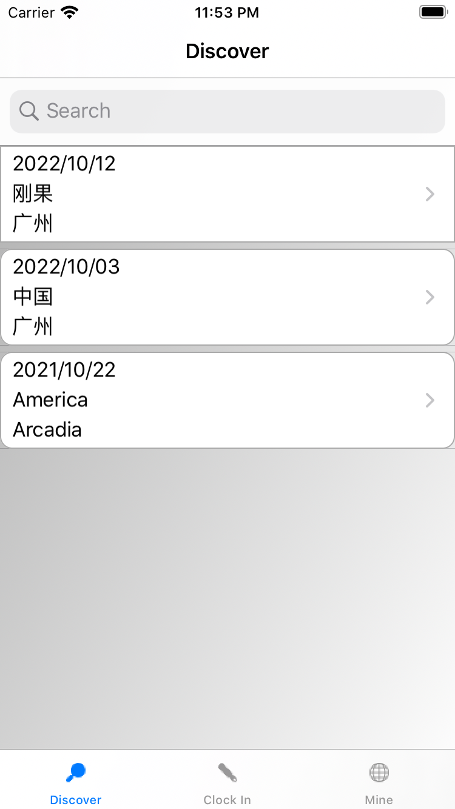
    
- 打卡界面
    
    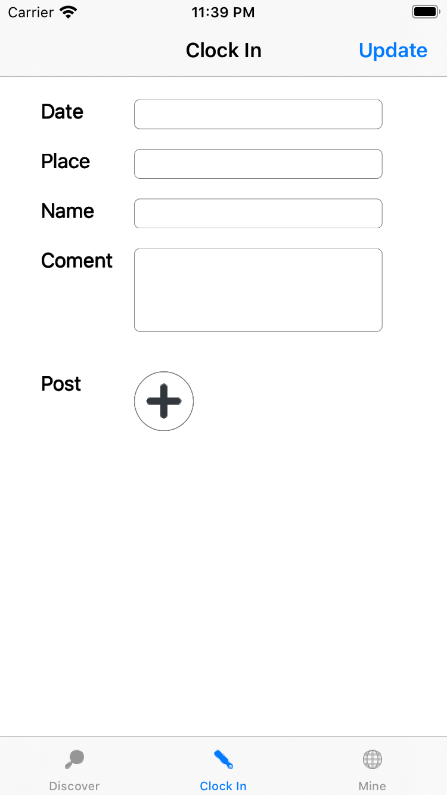
   

- 登录界面
    
    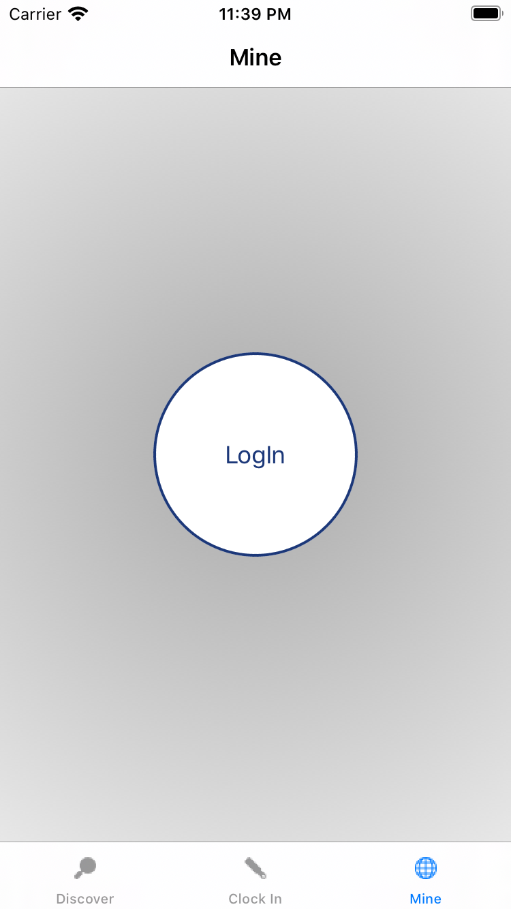
    
- 输入文本/上传图片进行打卡
    
    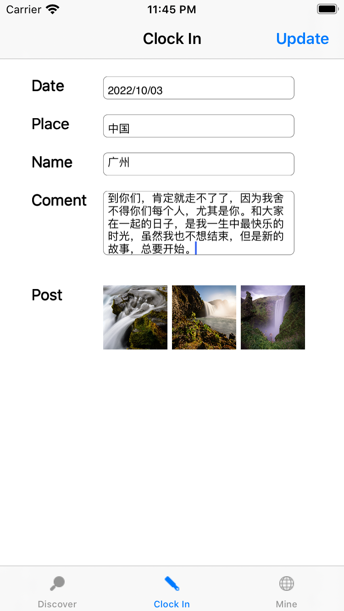
    
- 打卡详情
    
    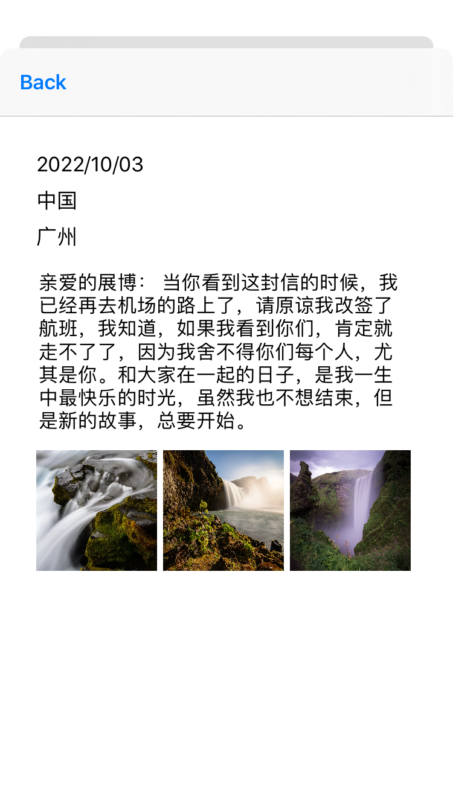
    

- 个人信息界面
    
    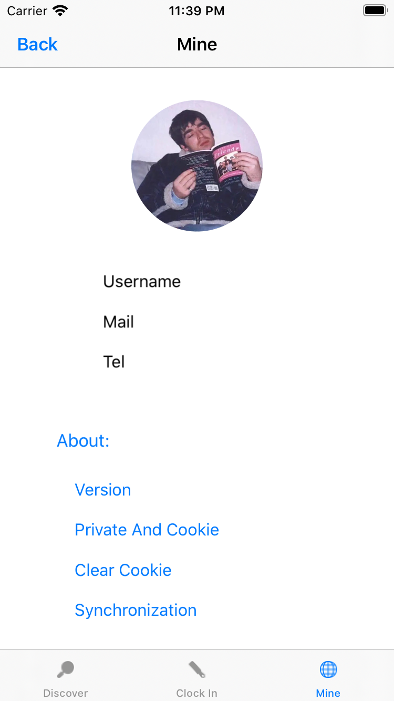
    
- 成功打卡
    
    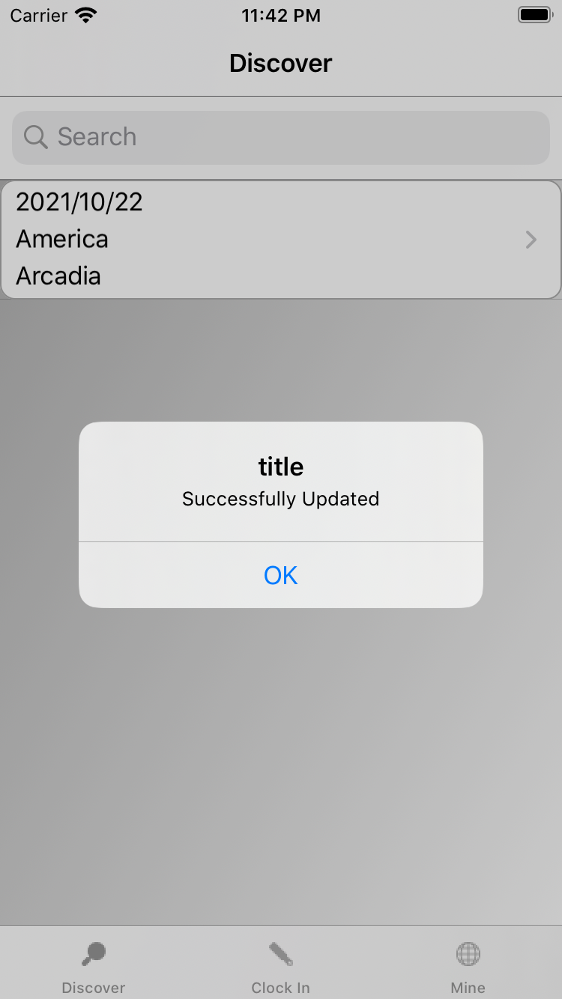
    
- 删除打卡
    
    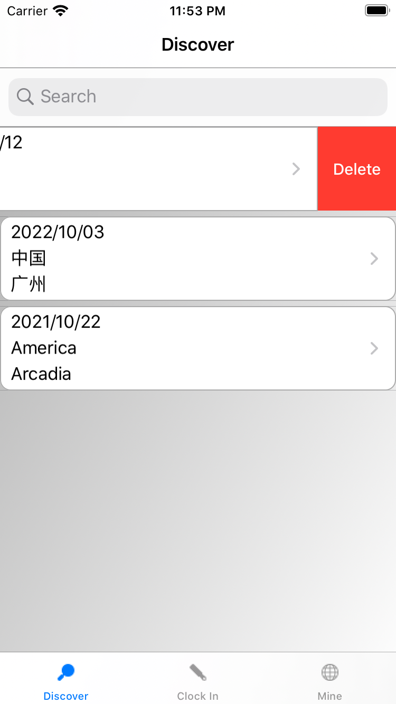
    

## 实验总结

**实验过程遇到问题及解决：**

**1.报错Thread 1: Exception: -[AppDelegate window]: unrecognized selector sent to instance**

闪退的原因是找不到UIApplication.sharedApplication的delegate里面找不到window这个属性。Xcode11 新建的项目中和之前的版本新建的项目有一些区别，Xcode11新建的项目中，多了一个SceneDelegate来管理界面，包括Window等。而AppDelegate只负责应用程序的声明周期管理。

解决：在AppDelegate添加window属性，给AppDelegate添加window的引用

2.**[Storyboard] Unknown class ViewController in Interface Builder file.**

‘Unknown class ViewController in Interface Builder file’的错误原因，就是因为新建项目中删掉了系统自动创建的那个ViewController，新建并使用了开发者自定义的ViweController， 但是项目工程main.storyboard中还是使用原来的ViewController。

解决：删除项目info.plist里面的”Main storyboard file base name“键值对和application session role-item0-storyboard name，删除main storyboard

**3.uiwindow初始化失败，黑屏**

解决：将初始化界面代码写在scene delegate的scene函数中

**4.设置登录按钮边框颜色时**

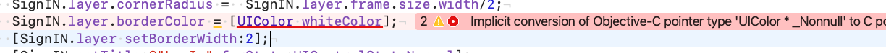

解决：后加.CGcolor

**5.设置输入框时**

Assigning to 'id<UITextViewDelegate> _Nullable' from incompatible type 'ClockinVC *const __strong’

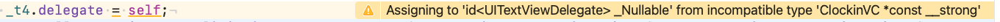

解决：改成（id)self 。由于自定义分类使用协议时出现与父类协议的冲突。

**6.点击发布按钮后页面空白，没有loadview**

解决：将定义视图内容的函数放在函数viewwillappear，每次加载页面都会调用该函数

**7.实现删除功能时报错：Thread 1: Exception: "Invalid update: invalid number of sections. The number of sections contained in the table view after the update (1) must be equal to the number of sections contained in the table view before the update (2), plus or minus the number of sections inserted or deleted (0 inserted, 0 deleted).”**

解决：将datalist中的该object移除后直接reloaddata，不用调用deleteRowsAtIndexPath

**8.删除选择条目时返回的[indexpath row]始终返回0**

解决:换成[indexpath section]

本次实验学习了视图与布局/常用控件以及简易的UIView动画等，明白了组件等基本使用。过程中因为xcode版本问题也停滞了比较长一段时间，但最后还是比较成功地实现了实验的基本要求，从零开始构建一个ios app。

## 参考文献

[https://blog.csdn.net/Morris_/article/details/109021827](https://blog.csdn.net/Morris_/article/details/109021827)

[https://blog.csdn.net/ocean_lxq/article/details/113882889](https://blog.csdn.net/ocean_lxq/article/details/113882889)

[http://t.zoukankan.com/silence-cnblogs-p-6405545.html](http://t.zoukankan.com/silence-cnblogs-p-6405545.html)

[https://www.kancloud.cn/cml244/javascript/1298361](https://www.kancloud.cn/cml244/javascript/1298361)

[https://www.656463.com/wenda/rhsyUISearchResultsUpdatingxsssj_142](https://www.656463.com/wenda/rhsyUISearchResultsUpdatingxsssj_142)