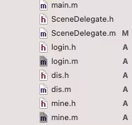
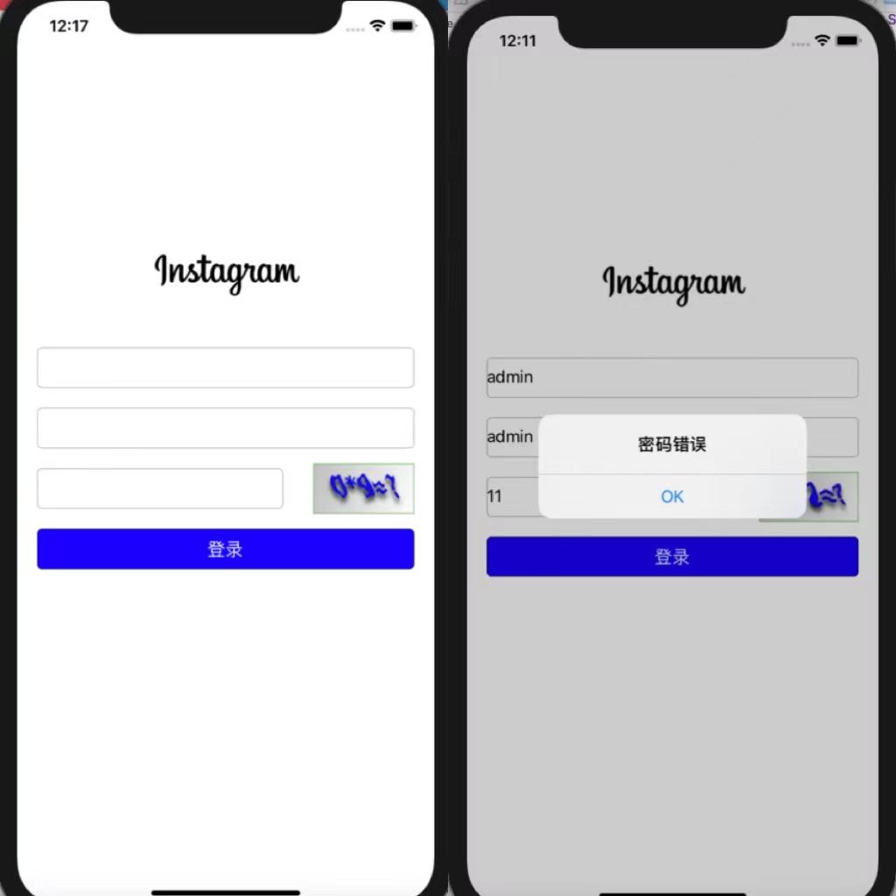
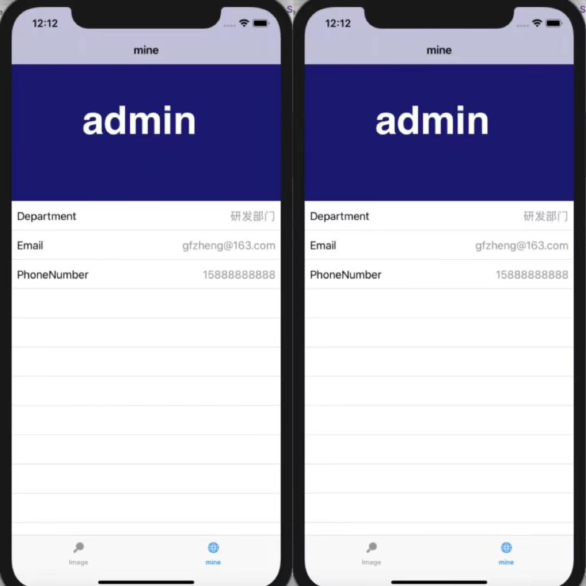
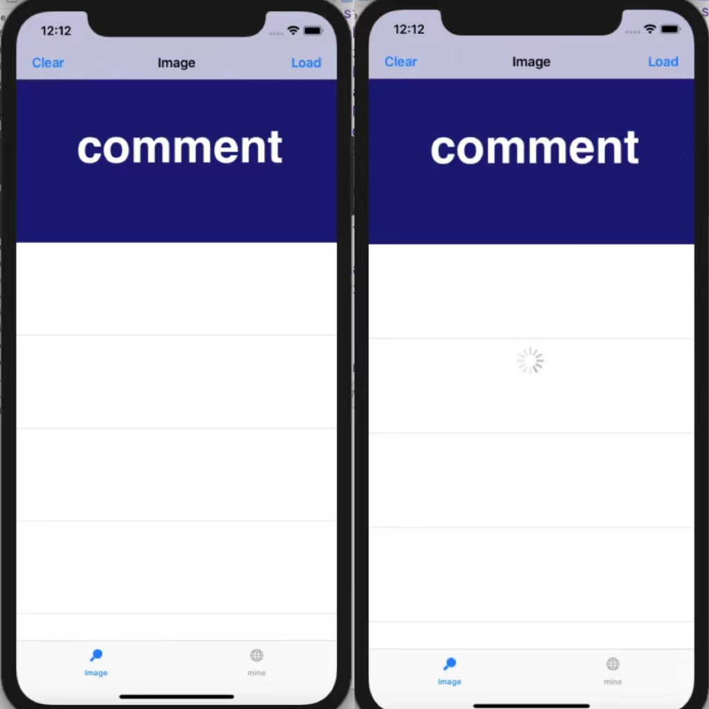
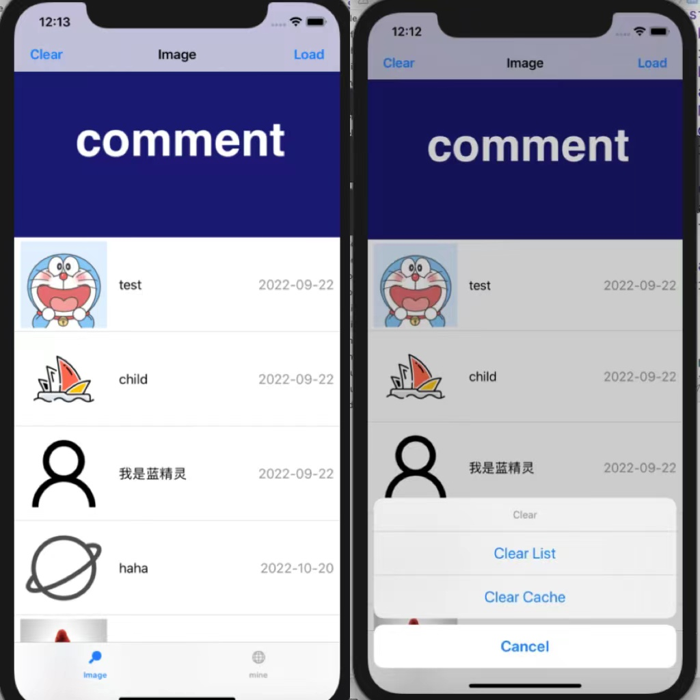

## 实验题目

网络访问和本地存储

## 实验目的

1. 学习使用NSURLSession或AFNetworking库进行网络访问
2. 学习iOS沙盒机制，进行文件读写操作

## 实验方案

### **开发环境**

- Mac OS
- Objective-C
- Xcode

### 实验要求

实现一个简单的“树洞”应用，主要有用户页面、图文页面两个页面

1. 用户页面，首先要通过用户名和密码、验证码进行登录，然后展示用户的基本信息。
2. 图文页面，包含一个Label，一个图文列表（可以用UICollectionView或UITableView），以及三个按钮（"加载" "清空" "删除缓存"）。
    - 点击"加载"按钮，若Cache中没有缓存的文件，则加载网络图文（含多条图片与文本信息）并显示在图文列表中，要求：图片下载完成前，显示loading图标；图片下载后，存入沙盒的Cache中。
    - 点击"加载"按钮，若Cache中已存在图文文件，则直接从Cache中读取出图文并显示，图片与文本可分别保存。
    - 点击"清空"按钮，清空图片列表中的所有图片。
    - 点击"删除缓存"按钮，删除存储在Cache中的图片文件。
3. 用户个人信息、图文列表的获取通过访问网络API实现。

### 代码结构



- SceneDelegate指定了self.window的根控制器为LogIn，即启动app首先跳出登录界面
- login为登录界面
- mine为用户个人信息界面
- dis为图文界面

**1.login**

登录页面组件包括三个UITextField：账号/密码/验证码 和两个UIButton：登录/刷新验证码。初始化页面时访问后端get api：captchaImag生成验证码并显示，用户输入正确的账号，密码及验证码，点击“登录”按钮实现登录。

- **实现API**

**get请求获取验证码**

构建Request对象-创建Session-创建NSURLSessionDataTask-执行Task-Respnse处理

```objectivec
- (void) vertify {
    NSURLSessionConfiguration *defaultConfigObject = [NSURLSessionConfiguration defaultSessionConfiguration];
    NSURLSession *defaultSession = [NSURLSession sessionWithConfiguration:defaultConfigObject delegate:(id)self delegateQueue:[NSOperationQueue mainQueue]];
    
    NSURL *url = [NSURL URLWithString:@"http://172.18.178.57:3000/prod-api/captchaImage"];
    NSURLRequest *request = [NSURLRequest requestWithURL:url];
    
    NSURLSessionDataTask *dataTask = [defaultSession dataTaskWithRequest:request completionHandler:^(NSData *data, NSURLResponse *response, NSError *error) {
        if(error == nil) {
            NSString *text = [[NSString alloc]initWithData:data encoding:NSUTF8StringEncoding];
            NSLog(@"Data=%@",text);
            //转成字典
            UIImage *decodedImage = [self JsonToImage:data];
            //设成一个按钮
            self.vtn = [[UIButton alloc]init];
            self.vtn.frame = CGRectMake(self.view.frame.size.width - 120, self.view.frame.size.height/4+235, 100, 50);
            [self.vtn setImage:decodedImage forState:UIControlStateNormal];
            [self.vtn addTarget:self action:@selector(vtnClicked) forControlEvents:UIControlEventTouchUpInside];
            [self.view addSubview:self.vtn];
        }
    }];
    [dataTask resume];
    //json to dict
}
```

将返回的报文转换成字典，取出字典中验证码图片对应的字段，将字符串转换成图片并设为按钮vtn的背景图片，点击验证码会重新发送get请求显示新的验证码图片。每个验证码的有效期是一次登录操作，若未成功登录，需要刷新验证码。

```objectivec
- (UIImage *)JsonToImage:(NSData *)data {
    NSError *err;
    NSDictionary *dic = [NSJSONSerialization JSONObjectWithData:data options:NSJSONReadingMutableContainers error:&err];
    if(err) {
        NSLog(@"json解析失败");
    }
    else {
        NSLog(@"我是一道分割线-----------");
    }
    //取出img对应的值
    NSString *imge = [dic objectForKey:@"img"];
    _uuid = [dic objectForKey:@"uuid"];
    NSLog(@"%@",_uuid);
    
    //字符串转data
    NSData *decodedImgData = [[NSData alloc] initWithBase64EncodedString:imge options:NSDataBase64DecodingIgnoreUnknownCharacters];
    //data转图片
    UIImage *decodedImage = [UIImage imageWithData:decodedImgData];
    return decodedImage;
}
```

**post请求实现登录**

构建可变的Request对象-设置请求方法为Post，设置请求体数据-创建Session-创建NSURLSessionDataTask-执行Task-Respnse处理

```objectivec
- (void)buttonClickd {
    _name = _t1.text;
    _pass = _t2.text;
    _code = _t3.text;
    NSLog(@"%@", self.name);
    NSLog(@"%@", self.pass);
    static NSDictionary *dict;
    NSURL *url = [NSURL URLWithString:@"http://172.18.178.57:3000/prod-api/login"];
    //构建可变的Request对象
		NSMutableURLRequest *urlRequest = [NSMutableURLRequest requestWithURL:url];
		//设置请求方法为Post
    [urlRequest setHTTPMethod:@"POST"];
		//设置请求体数据
    NSString *bodystr = [[NSString alloc]initWithFormat:@"{\"code\":\"%@\",\"password\":\"%@\",\"username\":\"%@\",\"uuid\":\"%@\"}",_code,_pass,_name,_uuid];
    [urlRequest setValue:@"application/json" forHTTPHeaderField:@"Content-Type"];
    [urlRequest setHTTPBody:[bodystr dataUsingEncoding:NSUTF8StringEncoding]];
    
    NSURLSession *session = [NSURLSession sharedSession];
    NSURLSessionDataTask *dataTask = [session dataTaskWithRequest:urlRequest completionHandler:^(NSData *data, NSURLResponse *response, NSError *error) {
        NSLog(@"我在登录");
        NSLog(@"Response:%@ %@\n",response,error);
        if(error == nil) {
            NSString *text = [[NSString alloc]initWithData:data encoding:NSUTF8StringEncoding];
            dict = [NSJSONSerialization JSONObjectWithData:data options:0 error:nil];
            NSLog(@"Data=%@",text);
            dispatch_sync(dispatch_get_main_queue(), ^{
                [self judge:dict];
            });
            }
    }];
    [dataTask resume];
}
```

根据返回报文判断是否成功登录，当输入正确的账号密码及验证码后会收到成功回复，调用onLogin函数，反之会提示登录失败原因，将msg返回字段设为弹框文字进行提示。

```objectivec
- (void)judge:(NSDictionary*)dic {
    NSString *msg = [dic objectForKey:@"msg"];//记录返回信息
    NSString *toke = [dic objectForKey:@"token"];
    NSLog(@"%@",msg);
    if([msg isEqual:@"操作成功"]) {
        /*UIAlertController *alert1 = [UIAlertController alertControllerWithTitle:@"title" message:@"Successfully LogIn" preferredStyle:UIAlertControllerStyleAlert];
        [self presentViewController:alert1 animated:true completion:nil];
        [alert1 dismissViewControllerAnimated:YES completion:nil];*/
        [NSThread sleepForTimeInterval:0.5];
        [self onLogin:toke];
    }
    else if([msg isEqual:@"验证码错误"]) {
        UIAlertController *alert1 = [UIAlertController alertControllerWithTitle:@"验证码错误" message:nil preferredStyle:UIAlertControllerStyleAlert];
        UIAlertAction* ok = [UIAlertAction actionWithTitle:@"OK" style:UIAlertActionStyleDefault handler:^(UIAlertAction * _Nonnull action) {
            NSLog(@"OK");
        }];
        [alert1 addAction:ok];
        [self presentViewController:alert1 animated:true completion:nil];
    }
    else if([msg isEqual:@"验证码已失效"]) {
        UIAlertController *alert1 = [UIAlertController alertControllerWithTitle:@"验证码已失效，请点击刷新" message:nil preferredStyle:UIAlertControllerStyleAlert];
        UIAlertAction* ok = [UIAlertAction actionWithTitle:@"OK" style:UIAlertActionStyleDefault handler:^(UIAlertAction * _Nonnull action) {
            NSLog(@"OK");
        }];
        [alert1 addAction:ok];
        [self presentViewController:alert1 animated:true completion:nil];
    }
    else if([msg isEqual:@"用户不存在/密码错误"]) {
        UIAlertController *alert1 = [UIAlertController alertControllerWithTitle:@"密码错误" message:nil preferredStyle:UIAlertControllerStyleAlert];
        UIAlertAction* ok = [UIAlertAction actionWithTitle:@"OK" style:UIAlertActionStyleDefault handler:^(UIAlertAction * _Nonnull action) {
            NSLog(@"OK");
        }];
        [alert1 addAction:ok];
        [self presentViewController:alert1 animated:true completion:nil];
    }
    else {
        UIAlertController *alert1 = [UIAlertController alertControllerWithTitle:@"用户不存在" message:nil preferredStyle:UIAlertControllerStyleAlert];
        UIAlertAction* ok = [UIAlertAction actionWithTitle:@"OK" style:UIAlertActionStyleDefault handler:^(UIAlertAction * _Nonnull action) {
            NSLog(@"OK");
        }];
        [alert1 addAction:ok];
        [self presentViewController:alert1 animated:true completion:nil];
    }
}
```

- **登录成功**

用户登录成功后会出现“用户”和“图文”两个界面，在onLogin函数中创建一个UITabBarController，初始化这两个界面的viewcontroller并加入导航栏中。

```objectivec
- (void)onLogin:(NSString *)toke {
    UITabBarController *bar = [[UITabBarController alloc]init];
    mine *mi = [[mine alloc]init];
    UINavigationController *m1 = [[UINavigationController alloc] initWithRootViewController:mi];
    m1.title = @"mine";
    m1.tabBarItem.selectedImage = [UIImage imageNamed:@"mineicon.png"];
    m1.tabBarItem.image = [UIImage imageNamed:@"mineicon.png"];
    m1.tabBarItem.title = @"mine";
    mi.token = toke;
    [mi getInfo];
    
    Dis *di = [[Dis alloc] init];
    UINavigationController *d1 = [[UINavigationController alloc] initWithRootViewController:di];
    d1.title = @"discover";
    d1.tabBarItem.selectedImage = [UIImage imageNamed:@"disicon.png"];
    d1.tabBarItem.image = [UIImage imageNamed:@"disicon.png"];
    d1.tabBarItem.title = @"discover";
    di.token = toke;
    [di getInfo];
    bar.viewControllers = @[d1,m1];
    bar.modalPresentationStyle = 0;
    [self presentViewController:bar animated:YES completion:nil];
}
```

**2.mine**

个人信息的获取通用需要网络访问，向相应的API发起get请求后，将返回的信息存进字典中。使用tableview来显示用户个人信息，通过不同的key来获取各种信息，再将其放进相应的cell中显示。若想在初次跳转到mine界面时就显示出个人信息，发送get请求应该放在onlogin初始化viewcontroller时完成。

- **获取用户信息的get请求**

```objectivec
- (void)getInfo{
    NSURLSessionConfiguration *defaultConfigObject = [NSURLSessionConfiguration defaultSessionConfiguration];
    NSURLSession *defaultSession = [NSURLSession sessionWithConfiguration:defaultConfigObject delegate:(id)self delegateQueue:[NSOperationQueue mainQueue]];
    
    NSURL *url = [NSURL URLWithString:@"http://172.18.178.57:3000/prod-api/system/user/profile"];
    NSMutableURLRequest *request = [NSMutableURLRequest requestWithURL:url];
    [request setValue:_token forHTTPHeaderField:@"Authorization"];
    
    NSURLSessionDataTask *dataTask = [defaultSession dataTaskWithRequest:request completionHandler:^(NSData *data, NSURLResponse *response, NSError *error) {
        NSLog(@"Response:%@ %@\n",response,error);
        if(error == nil) {
            NSString *text = [[NSString alloc]initWithData:data encoding:NSUTF8StringEncoding];
            if([NSThread isMainThread]) {
                NSLog(@"main");
            }
            else
            {
                NSLog(@"not main");
            }
            NSLog(@"丢");
            NSLog(@"Data=%@",text);
            //转成字典
            NSDictionary* dict = [NSJSONSerialization JSONObjectWithData:data options:0 error:nil];
            NSDictionary *data = [dict objectForKey:@"data"];
            self->_usrname = [data objectForKey:@"userName"];
            self->_dept = [[data objectForKey:@"dept"] objectForKey:@"deptName"];
            self->_email = [data objectForKey:@"email"];
            self->_phone = [data objectForKey:@"phonenumber"];
            self->_name = [[UILabel alloc]initWithFrame:CGRectMake(self.view.frame.size.width/4+5, self.view.frame.size.height/9+25, 4*self.view.frame.size.width/5, self.view.frame.size.height/9)];
            self->_name.text = self->_usrname;
            self->_name.textColor = [UIColor whiteColor];
            self->_name.font = [UIFont fontWithName:@"Helvetica-Bold" size:60.0];
            [self.view addSubview:self->_name];
        }
        
    }];
    [dataTask resume];
}
```

tableview的实现和代理与实验2中相似，此处不详细说明。不同的此处tableview并未使用自定义的customcell，直接将cell的style设为UITableViewCellStyleValue1，该样式左边是一个显示图片的imageView和一个主标题textLabel，右边是一个副标题detailTextLabel，主标题字体比较黑。

定义可变数组result存放用户个人信息，key为属性名，value为属性值

```objectivec
- (UITableViewCell *)tableView:(UITableView *)tableView cellForRowAtIndexPath:(NSIndexPath *)indexPath {
    static NSString *identifier = @"cell";
    UITableViewCell *cell = [tableView dequeueReusableCellWithIdentifier:identifier];
    if(cell == nil) {
        cell = [[UITableViewCell alloc] initWithStyle:UITableViewCellStyleValue1 reuseIdentifier:identifier];
        cell.accessoryType = UITableViewCellAccessoryNone;
    }
    /*cell.layer.cornerRadius = 10;
    cell.backgroundColor = UIColor.whiteColor;*/
    cell.textLabel.text = _result[indexPath.section][@"key"];
    cell.detailTextLabel.text = _result[indexPath.section][@"value"];
    return cell;
}
```

**3.dis**

使用tableview显示图文列表，在顶部导航栏添加load和clear两个buttonItem。定义可变数组dataList来存储每条评论的相关信息。

- **get请求获取图文内容**

```objectivec
- (void)getInfo {
    _dataList = [[NSMutableArray alloc]init];
    NSURLSessionConfiguration *defaultConfigObject = [NSURLSessionConfiguration defaultSessionConfiguration];
    NSURLSession *defaultSession = [NSURLSession sessionWithConfiguration:defaultConfigObject delegate:(id)self delegateQueue:[NSOperationQueue mainQueue]];
    
    NSURL *url = [NSURL URLWithString:@"http://172.18.178.57:3000/prod-api/yuan/comment/list"];
    NSMutableURLRequest *request = [NSMutableURLRequest requestWithURL:url];
    [request setValue:_token forHTTPHeaderField:@"Authorization"];
    
    NSURLSessionDataTask *dataTask = [defaultSession dataTaskWithRequest:request completionHandler:^(NSData *data, NSURLResponse *response, NSError *error) {
        NSLog(@"Response:%@ %@\n",response,error);
        if(error == nil) {
            NSString *text = [[NSString alloc]initWithData:data encoding:NSUTF8StringEncoding];
            if([NSThread isMainThread]) {
                NSLog(@"main");
            }
            else
            {
                NSLog(@"not main");
            }
            NSLog(@"丢");
            NSLog(@"Data=%@",text);
            //转成字典
            NSDictionary* dict = [NSJSONSerialization JSONObjectWithData:data options:0 error:nil];
            NSMutableArray *dota = [dict objectForKey:@"data"];
            for(NSInteger i=0;i<=dota.count-1&&dota.count;i++) {
                NSLog(@"%ld",i);
								//将每条评论返回的报文分别进行处理
                [self processDic:[dota objectAtIndex:i]:i];
            }
        }
    }];
    [dataTask resume];
}
```

process函数取出报文中评论内容/图片url/发布者/发布时间等字段并存储到字典中，并将字典加入dataList中

```objectivec
- (void)processDic:(NSDictionary*)dic
                  :(NSInteger)cnt{
    
    NSString *com = [dic objectForKey:@"content"];
    NSString *me1 = [dic objectForKey:@"media1"];
    NSString *time = [dic objectForKey:@"createTime"];
    NSString *head = @"http://172.18.178.57:3000/prod-api";
    NSString *mediaURL = [head stringByAppendingString:me1];
    NSLog(@"%@五金批发%@",com,mediaURL);
    
    NSDictionary *temp = [[NSDictionary alloc] init];
    NSString *cout = [[NSNumber numberWithInteger:cnt]stringValue];
    NSString *back = @".jpg";
    NSString *name = [cout stringByAppendingString:back];
    temp = @{@"pinglun":com,
             @"imgURL":mediaURL,
             @"name":name,
             @"time":time
    };
    NSLog(@"%@",temp);
    [self->_dataList addObject:temp];
    NSLog(@"%lu",self->_dataList.count);
}
```

- **加载**

点击load按钮后先判断cache中是否存在数据，若cache中已有数据，则图片直接从cache中加载；若cache没有相应图片，则从get请求返回报文中图片的url进行加载

```objectivec
//本地
- (void)getImag {
		//获取cache目录路径
    NSString *cach = [NSHomeDirectory() stringByAppendingPathComponent:@"Library/Caches"];
    NSLog(@"根目录 为%@",cach);
		//通过defaultmanager方法获取实例
    NSFileManager *fm = [NSFileManager defaultManager];
		//遍历文件夹
    NSArray *arr = [fm contentsOfDirectoryAtPath:cach error:nil];
		//imgarr存放图片url
    _imgarr = [[NSMutableArray alloc]init];
    NSInteger *cnt = 0;
    for (id key in arr) {
        NSString *tempStr = key;
				//若文件夹中有jpg文件，将文件路径加入imgarr
        if([tempStr rangeOfString:@".jpg"].location!= NSNotFound) {
            cnt++;
            NSString *temp = [[NSString alloc]init];
            temp = [NSHomeDirectory() stringByAppendingPathComponent:@"Library/Caches"];
            temp = [temp stringByAppendingPathComponent:key];
            NSLog(@"%@",temp);
            [_imgarr addObject:temp];
        }
    }
		//若文件夹中无jpg文件，调用load函数
    if (cnt == 0) {
        NSLog(@"空空空坎坎坷坷看坎坎坷坷");
        [self load];}
    else {
        NSLog(@"哈哈哈哈哈哈哈哈");
    }
    [self.tableView reloadData];
}
```

load函数从网络url加载图片写进cache中，加载结束后再次调用getImag来从cache中读取图片

```objectivec
- (void)load {
    [[[NSOperationQueue alloc] init] addOperationWithBlock:^{
        NSLog(@"下载中。。。。。");
        [[NSOperationQueue mainQueue] addOperationWithBlock:^{
            NSArray* array = NSSearchPathForDirectoriesInDomains(NSCachesDirectory, NSUserDomainMask, YES);
            NSString *path = array[0];
            NSFileManager * existmanager = [NSFileManager defaultManager];
            NSLog(@"%@",path);
            for(NSInteger i=0;i<=self->_dataList.count-1&&self->_dataList.count;i++) {
                NSString *imageFilePath = [path stringByAppendingPathComponent:[[self->_dataList objectAtIndex:i] objectForKey:@"name"]];
								//从dataList中取出图片url，转换成nsdata并生成图片
                NSString *url = [[self->_dataList objectAtIndex:i] objectForKey:@"imgURL"];
                NSData *data1 = [NSData dataWithContentsOfURL:[NSURL  URLWithString:url]];
                UIImage *image1 = [[UIImage alloc]init];
                image1 = [UIImage imageWithData:data1];
                NSLog(@"cunrupath:%@",imageFilePath);
                NSFileManager *fm = [NSFileManager defaultManager];
                bool a = [fm createFileAtPath:imageFilePath contents:nil attributes:nil];
                NSLog(@"%d",a);
								//将图片写入cache
                [UIImagePNGRepresentation(image1) writeToFile:imageFilePath  atomically:YES];
            }
            
            [NSThread sleepForTimeInterval:0.5];
            [self getImag];
                        }];
    }];
    
}
```

由于获取到的图片尺寸大小不一，为了让其统一大小地显示在cell中，在设置cell图片时重绘图片

```objectivec
CGSize itemSize = CGSizeMake(70, 70);
UIGraphicsBeginImageContext(itemSize);
CGRect imageRect = CGRectMake(0, 0, itemSize.width, itemSize.height);
[icon drawInRect:imageRect];
cell.imageView.image = UIGraphicsGetImageFromCurrentImageContext();
```

**加载动画**

使用UIActivityIndicatorView作为活动指示器

```objectivec
		_indicate = [[UIActivityIndicatorView alloc]initWithFrame:CGRectMake(self.view.frame.size.width/2-15, self.view.frame.size.height/2-15, 30, 30)];
    _indicate.activityIndicatorViewStyle = UIActivityIndicatorViewStyleLarge;
    _indicate.color = [UIColor lightGrayColor];
    [self.view addSubview:_indicate];
    [_indicate startAnimating];
		/*活动进行中*/
		[self->_indicate stopAnimating] ;
```

- **清空**

由于cell显示的图片是由imgarr的文件路径来获取，清空列表只需要将数组imgarr清空并reloaddata即可

```objectivec
- (void)clearLi {
    [_imgarr removeAllObjects];
    [_tableView reloadData];
}
```

- **清除cache**

清除缓存调用NSFileManger的removeItemAtPath即可删除对应路径的缓存文件，清除缓存后同样要清除文件路径和reload data

```objectivec
- (void)clearCa {
    NSFileManager *fm = [NSFileManager defaultManager];
    NSArray* array = NSSearchPathForDirectoriesInDomains(NSCachesDirectory, NSUserDomainMask, YES);
    NSString *path = array[0];
    NSEnumerator *fileEnum = [[fm subpathsAtPath:path]objectEnumerator];
    NSString *filepath;
    while ((filepath = [fileEnum nextObject])!=nil) {
        NSString *str = [path stringByAppendingPathComponent:filepath];
        [fm removeItemAtPath:str error:nil];
    }
    [_imgarr removeAllObjects];
    [_tableView reloadData];
}
```

## 实验过程

- 登录界面及错误提示消息
    
    
    
- 用户信息界面
    
    
    
- 初始化图文列表界面：点击右上角load进行加载
    
    
    
- 加载图文列表，点击左上角clear跳出弹框选择清空列表或内存
    
    
    

## 实验总结

**实验过程遇到问题及解决：**

1. 验证码返回的json数据如何转换成图片
    
    将json data转换字典，取出验证图片对应的字段存进字符串，将图片字符串转换回NSData，最后使用imageWithData将decode的NSData转成UIImage
    
2. 登录post请求返回**Data={"msg":"Content type 'application/x-www-form-urlencoded;charset=UTF-8' not supported","code":500}**
    
    将request的content-type设为要求的格式
    
    ```java
    [urlRequest setValue:@"application/json" forHTTPHeaderField:@"Content-Type"];
    ```
    
3. textfield首字母输入自动大写，导致无法正确输入账号密码
    
    将textfield的setAutocapitalizationType设为none
    
4. 在http请求过程中修改变量无效：在块内修改块外定义变量失败
    
    声明变量时加上static，在块内访问
    
5. json解析过程中，若是全是数字，会默认成nscfnumber，而不是NSInteger，需要变成nsstring才能保存
6. 发送请求，获取响应并处理它们的功能时遇到问题，然后显示UIAlertView告诉用户这是什么问题。判断返回信息时报错
    
    **[Assert] Cannot be called with asCopy = NO on non-main thread.**
    
    在使用oc开发时，如果遇到thread报错，那么可能就是在进行ui操作的时候没有放在主线程中导致的，手动切换到主线程
    
    ```java
    dispatch_sync(dispatch_get_main_queue(), ^{
    		//切换到主线程后再调用
    		[self judge:dict];
    });
    ```
    
7. 如何从登录页面跳到uitabbarcontroller
    
    一开始在将哪个页面设为self.window的根控制器时停留了很久，后发现如果想要在初始化app时先显示登录界面，登录成功后才能访问其他界面时，直接present uitabbarcontroller就好，不用修改rootview
    
8. ios13后presentviewcotroller不全屏
    
    将bar到=的modal presentationstyle设为0
    
9. 拉取个人信息时返回认证失败，无法访问系统资源，code=401
    
    在登录成功后返回的报文中包含token。Token是服务端生成的一串字符串，以作客户端进行请求的一个令牌，当第一次登录后，服务器生成一个Token便将此Token返回给客户端，以后客户端只需带上这个Token前来请求数据，无需再次带上用户名和密码。
    
    在发送个人信息的get请求时，将nsurl request换成nsmutableurl request在请求头添加token即可
    
10. uitableview分割线不全屏
    
    可以通过自定义cell来解决，这里通过修改系统属性设置(separatorInset, layoutMargins)来实现
    
    首先在viewDidLoad中加上如下代码
    
    ```objectivec
    -(void)viewDidLoad {
    	 [super viewDidLoad];
    	 if ([self.tableView respondsToSelector:@selector(setSeparatorInset:)]) {
    		 [self.tableView setSeparatorInset:UIEdgeInsetsZero];
    	 }
    	 if ([self.tableView respondsToSelector:@selector(setLayoutMargins:)]) {
    		 [self.tableView setLayoutMargins:UIEdgeInsetsZero];
    	 }
    }
    ```
    
    然后在willDisplayCell方法中加入如下代码：
    
    ```objectivec
    - (void)tableView:(UITableView *)tableView willDisplayCell:(UITableViewCell *)cell forRowAtIndexPath:(NSIndexPath *)indexPath
    {
    	 if ([cell respondsToSelector:@selector(setSeparatorInset:)]) {
    		 [cell setSeparatorInset:UIEdgeInsetsZero];
    	 }
    	 if ([cell respondsToSelector:@selector(setLayoutMargins:)]) {
    		 [cell setLayoutMargins:UIEdgeInsetsZero];
    	 }
    }
    ```
    
11. 将发送get请求封装成一个函数，调用该函数需要一段时间，在这段时间里主线程在没有get到数据的情况下继续执行，导致无法成功显示个人信息
    
    在成功登录时就调用get获取个人信息，而不是放在controller的viewdidload里面
    
12. 类的成员变量中声明了数组之后使用的时候记得初始化，不然无法向数组中addobject

本次实验第一次接触到网络编程的知识，实际运用了http请求向相应的api获取数据并显示在前端，同时对于IOS本地缓存的操作有了了解和学习。本次实验最大的障碍在于判断请求的异步和同步以及线程的切换。

